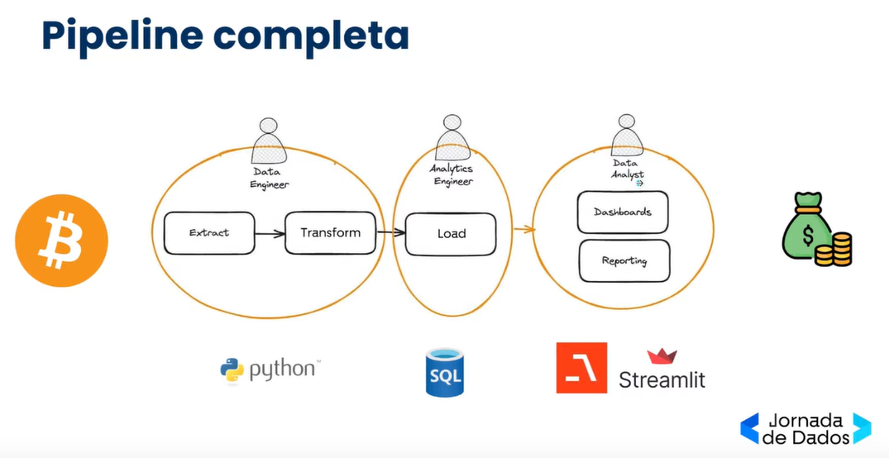

# ETL Data Pipeline Project

Este projeto implementa um pipeline de dados ETL (Extract, Transform, Load) utilizando tecnologias modernas para extração de dados via API, armazenamento em banco de dados PostgreSQL, cálculo de KPIs e visualização interativa com Streamlit.

## Agente de IA para Análise de Criptoativos

Este projeto também inclui um agente de inteligência artificial para análise do mercado de criptoativos. O agente utiliza algoritmos avançados de machine learning para fornecer insights sobre investimentos em portfólios de criptomoedas, como Bitcoin (BTC), Ethereum (ETH) e Solana (SOL).

### Funcionalidades do Agente de IA

- **Análise de Mercado**:
    - Coleta e análise de dados de mercado em tempo real para identificar tendências e padrões.

- **Recomendações de Investimento**:
    - Geração de insights personalizados para otimização de portfólios de criptoativos.

- **Monitoramento Contínuo**:
    - Acompanhamento constante do mercado para alertar sobre oportunidades ou riscos.

- **Relatórios Interativos**:
    - Visualização de dados e recomendações diretamente na interface Streamlit.

### Tecnologias Adicionais

- **Pandas e NumPy**: Para manipulação e análise de dados.
- **Scikit-learn e TensorFlow**: Para construção e treinamento de modelos de machine learning.
- **APIs de Mercado**: Integração com APIs de exchanges de criptomoedas para coleta de dados em tempo real.
- **Matplotlib e Plotly**: Para criação de gráficos e visualizações interativas.

### Como Utilizar o Agente de IA

1. Certifique-se de que as variáveis de ambiente relacionadas às APIs de mercado estão configuradas no arquivo `.env`.
2. Execute o pipeline completo utilizando o Docker Compose.
3. Acesse a interface Streamlit para explorar os insights gerados pelo agente de IA.


## Arquitetura do Projeto

Abaixo está a arquitetura geral do pipeline:



## Tecnologias Utilizadas

- **Python**: Linguagem principal para desenvolvimento do pipeline.
- **FastAPI**: Framework para criação de APIs rápidas e eficientes.
- **PostgreSQL**: Banco de dados relacional para armazenamento dos dados transformados.
- **Streamlit**: Ferramenta para visualização de dados e cálculo de KPIs.
- **Docker**: Para containerização e fácil deploy do projeto.

## Funcionalidades

1. **Extração de Dados**:
    - Extração de dados de uma API externa utilizando Python e FastAPI.

2. **Transformação de Dados**:
    - Processamento e limpeza dos dados para adequação ao modelo de dados.

3. **Armazenamento**:
    - Salvamento dos dados transformados em um banco de dados PostgreSQL.

4. **Cálculo de KPIs**:
    - Cálculo de indicadores-chave de desempenho (KPIs) com Streamlit.

5. **Visualização Interativa**:
    - Interface interativa para visualização dos KPIs e exploração dos dados.

## Como Executar

### Pré-requisitos

- Python 3.8+
- Docker e Docker Compose
- PostgreSQL

### Passos

1. Clone o repositório:
    ```bash
    git clone https://github.com/seu-usuario/seu-repositorio.git
    cd seu-repositorio
    ```

2. Configure as variáveis de ambiente no arquivo `.env`.

3. Suba os serviços com Docker Compose:
    ```bash
    docker-compose up --build
    ```

4. Acesse a API no endereço [http://localhost:8000](http://localhost:8000).

5. Acesse a interface Streamlit no endereço [http://localhost:8501](http://localhost:8501).

## Estrutura do Projeto

```plaintext
├── app/
│   ├── main.py          # Código principal da API
│   ├── models/          # Modelos de dados
│   ├── services/        # Lógica de extração e transformação
├── streamlit_app/
│   ├── app.py           # Código principal da interface Streamlit
├── image/
│   ├── architecture.PNG # Imagem da arquitetura
├── docker-compose.yml   # Configuração do Docker Compose
├── README.md            # Documentação do projeto
```

## Contribuição

Contribuições são bem-vindas! Sinta-se à vontade para abrir issues ou enviar pull requests.

## Licença

Este projeto está licenciado sob a [MIT License](LICENSE).
